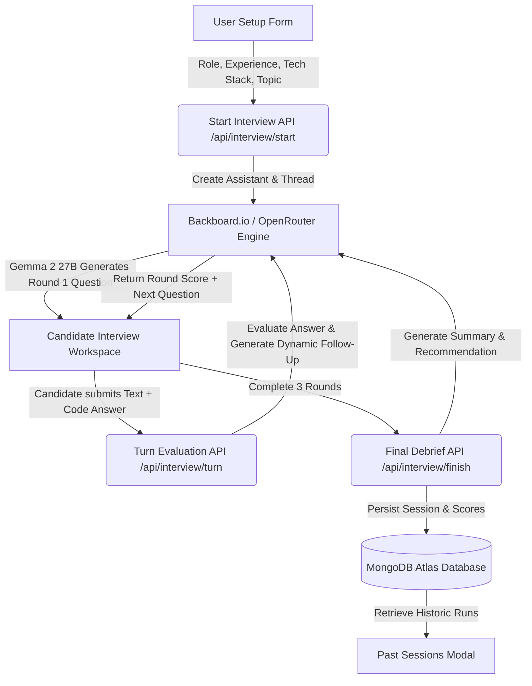

<div align="center">
  
  <h1>PrepPulse</h1>
  <p><strong>Adaptive 3-Round AI Technical Mock Interviewer powered by Google Gemma 2 27B & MongoDB Atlas</strong></p>

  <p>
    <a href="#overview">Overview</a> •
    <a href="#key-features">Key Features</a> •
    <a href="#system-architecture--flow">System Architecture</a> •
    <a href="#tech-stack">Tech Stack</a> •
    <a href="#getting-started">Getting Started</a> •
    <a href="#api-reference">API Reference</a> •
    <a href="#project-structure">Project Structure</a>
  </p>
</div>

---

## 🚀 Overview

**PrepPulse** is a technical mock interview platform designed to simulate rigorous real-world coding and system engineering interviews. Built with **Next.js 16 (App Router)**, **Tailwind CSS v4**, and styled in an ultra-clean **Linear / Raycast dark aesthetic**, PrepPulse evaluates candidates across adaptive 3-round scenarios using **Google Gemma 2 27B** served via **Backboard.io** (with automatic low-latency fallback to **OpenRouter**).

Candidates receive real-time granular score breakdowns (0–100 scale across Technical Accuracy, Architecture, and Communication), stateful dynamic follow-up questions that challenge past weaknesses, embedded multi-language code editing, and long-term interview session analytics backed by **MongoDB Atlas**.

---

## ✨ Key Features

- **⚡ Adaptive 3-Round Dynamic Interview Engine**:
  - **Round 1 (Core Concepts & Fundamentals)**: Tests foundational problem-solving and computer science depth.
  - **Round 2 (Architecture & System Design)**: Focuses on scalability, distributed systems, edge-cases, and structural trade-offs.
  - **Round 3 (Real-World Debugging & Optimization)**: Presents complex edge cases, concurrency pitfalls, or code performance bottlenecks.
- **🧠 Google Gemma 2 27B Intelligence**:
  - Direct integration with **Backboard.io Assistants API** for thread-managed memory and structured JSON outputs.
  - Automatic fallback mechanism to **OpenRouter Free Tier** for 99.9% uptime during API rate limits.
- **💻 Dual Answer Editor (Text + Syntax-Highlighted Code Editor)**:
  - Rich answer field with one-click **`+ Code Block`** injector for seamless inline code snippets.
  - Integrated syntax-highlighted **Code Sandbox** supporting TypeScript, JavaScript, Python, Go, and Rust.
- **📊 Granular Real-Time Evaluation Matrix**:
  - **Technical Score (0–100)**: Accuracy, algorithmic precision, and code efficiency.
  - **Communication Score (0–100)**: Clarity, structured explanations, and trade-off articulation.
  - **Architecture Score (0–100)**: Modular thinking, resiliency, and system scalability.
  - Qualitative analysis: *Strengths*, *Areas to Improve*, *Ideal Answer Model*, and a *Tailored Dynamic Follow-up*.
- **🏆 Comprehensive Final Performance Debrief**:
  - Calculates cumulative score averages, performance tiers (*Ready for Senior/Staff*, *Intermediate Competency*, *Needs Practice*), and personalized interview takeaways.
- **🗄️ MongoDB Atlas Persistence & History Dashboard**:
  - Automatically records full conversation turns, evaluations, candidate parameters, and timestamps.
  - Interactive "Past Sessions" drawer to review historical mock interviews and track progression over time.
- **🎨 Distraction-Free Dark Mode Developer Experience**:
  - Polished Raycast/Linear-inspired dark interface with glassmorphism overlays and zero cluttered side-bars during active interviews.

---

## 🔄 System Architecture & Flow



### Complete Round Lifecycle:
1. **Onboarding & Configuration**: The candidate specifies their target role (Full Stack Developer, Backend Architect, Frontend Engineer, DevOps, etc.), years of experience, primary tech stack, and focus area.
2. **Contextual Question Generation**: Gemma 2 27B crafts an interview question calibrated to the candidate's exact stack and seniority.
3. **Candidate Response**: The candidate provides their architectural reasoning, accompanied by relevant code implementations.
4. **Adaptive Scoring & Feedback**: The engine scores the response across all 3 metrics, flags areas of improvement, and tailors the next question to drill deeper into detected weak spots.
5. **Debrief & Cloud Archiving**: Upon completing Round 3, a full debrief is rendered, and session results are saved to MongoDB Atlas.

---

## 🛠️ Tech Stack

| Layer | Technology | Description |
| :--- | :--- | :--- |
| **Framework** | [Next.js 16 (App Router)](https://nextjs.org/) | React 19 server/client components, zero-latency server routes |
| **Styling** | [Tailwind CSS v4](https://tailwindcss.com/) + Vanilla CSS | Dark mode design system with glassmorphic tokens |
| **UI Components** | [Radix UI](https://www.radix-ui.com/) + [Lucide Icons](https://lucide.dev/) | Accessible dialogs, drawers, buttons, and status indicators |
| **Motion** | [Framer Motion](https://www.framer.com/motion/) | Smooth layout transitions and interactive micro-animations |
| **AI LLM** | **Google Gemma 2 27B** | High-precision reasoning model for technical evaluation |
| **AI Inference** | [Backboard.io](https://backboard.io/) | Primary Assistants API gateway with session threads |
| **AI Fallback** | [OpenRouter](https://openrouter.ai/) | Secondary OpenAI-compatible fallback endpoint |
| **Database** | [MongoDB Atlas](https://www.mongodb.com/atlas) | Serverless document storage for interview history and analytics |

---

## ⚙️ Getting Started

### Prerequisites
- **Node.js**: v18.17.0 or higher
- **npm**, **yarn**, or **pnpm**
- **MongoDB Atlas** cluster URI
- **Backboard API Key** (and optional **OpenRouter API Key**)

### 1. Clone the Repository
```bash
git clone https://github.com/Ankit-Kum-ar/preppulse.git
cd preppulse
```

### 2. Install Dependencies
```bash
npm install
```

### 3. Configure Environment Variables
Create a `.env` file in the root directory and add the following keys:

```env
# MongoDB Atlas Connection URI
MONGODB_URI=mongodb+srv://<username>:<password>@<cluster>.mongodb.net/preppulse?retryWrites=true&w=majority
MONGODB_DB=preppulse

# Backboard.io Primary AI Gateway
BACKBOARD_API_KEY=espr_your_backboard_api_key_here
BACKBOARD_BASE_URL=https://app.backboard.io/api

# OpenRouter Secondary Fallback (Optional but recommended)
OPENROUTER_API_KEY=sk-or-v1-your_openrouter_api_key_here
```

### 4. Run Development Server
```bash
npm run dev
```

Visit [`http://localhost:3000`](http://localhost:3000) in your browser.

---

## 🔌 API Reference

### 1. System Health Check
- **`GET /api/health`**
  - Returns connection health status for MongoDB Atlas and AI provider connectivity.

### 2. Start Mock Interview
- **`POST /api/interview/start`**
  - **Request Body**:
    ```json
    {
      "friendName": "Alex",
      "role": "Full Stack Developer",
      "experience": "3-5 years (Mid-Level)",
      "techStack": "Next.js, TypeScript, PostgreSQL, Docker",
      "topic": "System Design & Distributed Caching"
    }
    ```
  - **Response**: Returns session metadata, initial `threadId`, `assistantId`, and the first technical question.

### 3. Submit Round Turn & Evaluate
- **`POST /api/interview/turn`**
  - **Request Body**:
    ```json
    {
      "threadId": "thr_abc123",
      "assistantId": "asst_xyz789",
      "round": 1,
      "userAnswer": "I would utilize Redis with a cache-aside pattern...",
      "role": "Full Stack Developer",
      "techStack": "Next.js, TypeScript, Redis",
      "currentQuestion": "How do you avoid cache stampedes during traffic spikes?"
    }
    ```
  - **Response**: Structured JSON containing score breakdown (`technicalScore`, `communicationScore`, `architectureScore`), strengths, areas to improve, ideal answer, and the next round question.

### 4. Conclude Interview & Persist
- **`POST /api/interview/finish`**
  - Finalizes the 3-round interview, calculates final aggregated performance statistics, and stores the completed session document in MongoDB Atlas.

### 5. Past Interview History
- **`GET /api/interview/history`**
  - Retrieves the latest recorded mock interviews with aggregated scores and timestamps.

---

## 📁 Project Structure

```
preppulse/
├── public/                     # Static assets & branding icons
├── src/
│   ├── app/
│   │   ├── api/
│   │   │   ├── health/         # System health & DB diagnostic routes
│   │   │   └── interview/      # Next.js API route handlers (start, turn, finish, history)
│   │   ├── globals.css         # Linear/Raycast design system & tokens
│   │   ├── layout.tsx          # Root HTML layout & font definitions
│   │   └── page.tsx            # Main state orchestrator
│   ├── components/
│   │   ├── interview/          # Core interview screens
│   │   │   ├── SetupCard.tsx           # Role, seniority & stack configuration form
│   │   │   ├── InterviewWorkspace.tsx  # Question terminal, turn counter & code/text answer editor
│   │   │   ├── EvaluationCard.tsx      # Real-time round score matrix & feedback
│   │   │   ├── FinalDebriefCard.tsx    # Comprehensive 3-round performance debrief
│   │   │   └── PastSessionsView.tsx    # Historical session viewer with MongoDB data
│   │   ├── layout/             # Navigation bars
│   │   │   ├── Navbar.tsx              # Adaptive floating header
│   │   │   ├── DesktopNavbar.tsx       # Live Gemma 2 engine status pill
│   │   │   └── MobileNavbar.tsx        # Responsive mobile slide-out drawer
│   │   ├── ui/                 # Reusable Radix & custom UI primitives (Card, Button, Dialog, Sheet)
│   │   └── AnswerEditor.tsx    # Code sandbox & text answer editor with quick block insertion
│   ├── lib/
│   │   ├── ai-engine.ts        # Gemma 2 27B client with Backboard & OpenRouter fallback
│   │   ├── mongodb.ts          # Cached MongoDB Atlas connection manager
│   │   └── utils.ts            # Utility functions (cn, class merge)
│   └── types/
│       └── interview.ts        # TypeScript schemas & interface definitions
├── .env                        # Local environment secrets
├── package.json
└── tsconfig.json
```

---

## 🤝 Contributing

Contributions, issues, and feature requests are welcome! Feel free to check the [issues page](https://github.com/Ankit-Kum-ar/preppulse/issues).

1. Fork the Project
2. Create your Feature Branch (`git checkout -b feature/AmazingFeature`)
3. Commit your Changes (`git commit -m 'Add some AmazingFeature'`)
4. Push to the Branch (`git push origin feature/AmazingFeature`)
5. Open a Pull Request

---

## 📄 License

Distributed under the MIT License. See `LICENSE` for more information.
